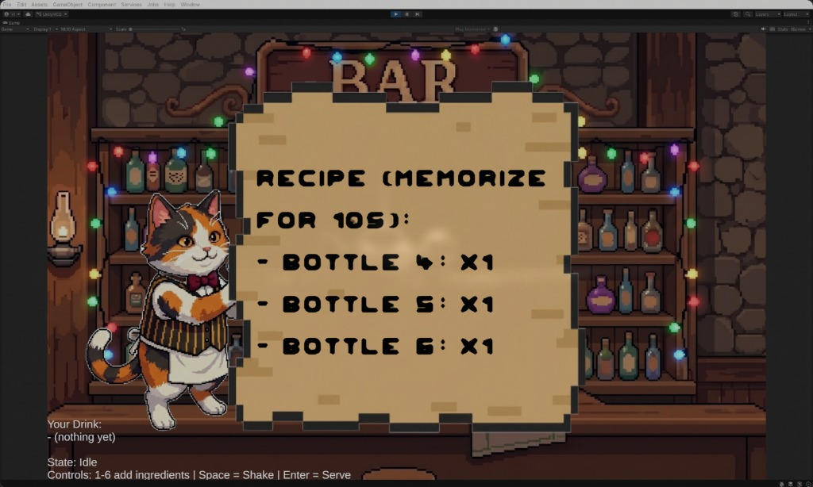
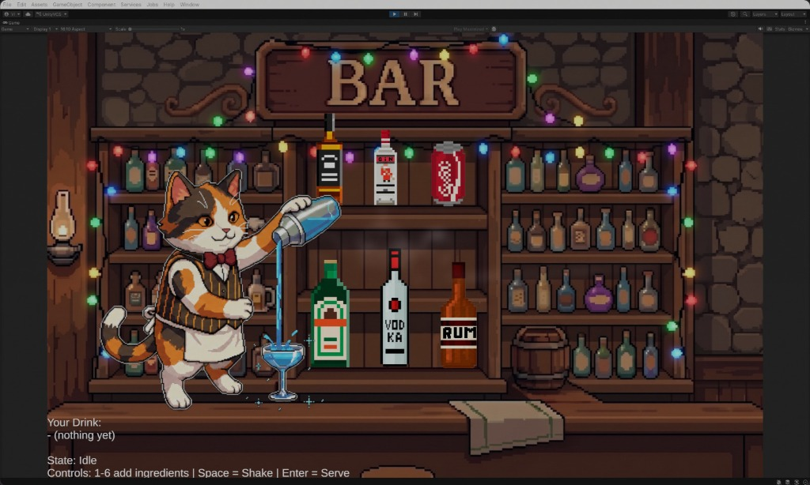
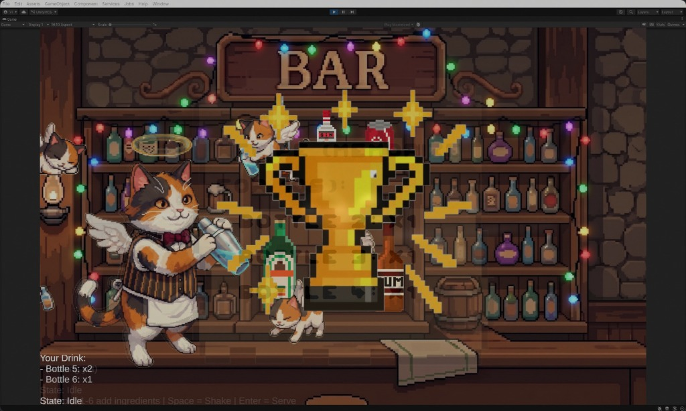

# 🐱 BCI Bartender Cat Game 🍸

**A Brain-Computer Interface Cocktail Mixing Game**

Mix drinks, memorize recipes, and serve cocktails — all controlled with your brain!

---

## About the Game

BCI Bartender Cat Game is a pixel-art bartending game built in **Unity**, where you play as an adorable calico cat bartender mixing drinks behind a cozy bar. The twist? You can control it using a **Brain-Computer Interface (BCI)** headset — the **Unicorn Hybrid Black** by g.tec.

**How It Works:**

1. **Memorize the Recipe** — A recipe card flashes on screen for 10 seconds, showing which bottles and how many shots of each you need.
2. **Mix the Drink** — Select the right bottles (keys `1`–`6` or via BCI input) to pour ingredients into the cocktail glass.
3. **Shake It Up** — Press `Space` to shake the drink.
4. **Serve** — Press `Enter` to serve. Match the recipe and win a golden trophy!

The game supports both **keyboard input** and **BCI (ERP-based) input**, making it a unique neurotechnology project that turns brain signals into in-game actions.

---

## Screenshots

| Recipe Memorization | Mixing Drinks | Victory! |
|:---:|:---:|:---:|
|  |  |  |
| *Memorize bottles and quantities before time runs out.* | *Pour from 6 bottles to craft the perfect cocktail.* | *Nail the recipe and earn a sparkling golden trophy!* |

<p align="center">
  
</p>

---

## BCI Integration

This project integrates the **Unicorn Hybrid Black** EEG headset using g.tec's **Unity ERP API**. The BCI module uses Event-Related Potentials (ERPs) to detect which on-screen bottle the player is focusing on, enabling hands-free ingredient selection through neural signals.

**Key Components:**

- `IInputSource` — Abstraction layer decoupling game logic from input method
- `KeyboardInputSource` — Standard keyboard controls for development and testing
- `BCIInputSource` — BCI-based input using the Unicorn Hybrid Black ERP pipeline
- `BCITrainingAutoBootstrap` — Automated training sequence for the BCI classifier
- `BottleFlashController` — Handles visual flashing of bottles for ERP stimulation and gameplay feedback

---

## Tech Stack

| Technology | Purpose |
|---|---|
| Unity 2022.3+ | Game engine |
| C# | Game scripting |
| g.tec Unicorn Suite | BCI headset SDK |
| Unicorn Hybrid Black | EEG headset hardware |
| TextMesh Pro | In-game UI text rendering |
| Pixel Art | 2D sprite-based art style |

---

## Getting Started

**Prerequisites:**

- [Unity Editor](https://unity.com/download) 2022.3.62f3 or later
- [Unicorn Suite Hybrid Black](https://drive.google.com/drive/folders/17qbtoRuF21MZq9gWymBsGcsaGAOl3G7E?usp=sharing) *(for BCI mode)*
- A Git client ([git-bash](https://gitforwindows.org/) or [GitHub Desktop](https://desktop.github.com/))

**Installation:**

1. Clone the repository:
   ```bash
   git clone https://github.com/UVT-Neuroscience-Lab/BCI-Bartender-Cat-Game.git
   ```
2. Open Unity Hub → Open → select the cloned project folder.
3. Wait for Unity to import all assets.
4. Open the main scene from `Assets/Scenes/`.
5. Hit **Play** to start the game.

**Controls:**

| Key | Action |
|---|---|
| `1` – `6` | Add ingredient from corresponding bottle |
| `Space` | Shake the drink |
| `Enter` | Serve the drink |

> **Note:** For BCI mode, connect the Unicorn Hybrid Black headset through Unicorn Suite before running the game. The BCI training sequence will start automatically.

---

## Team

Vlad Stefan Ifju · Helga Ingrid Hochbauer · Andrei Raul Dragomir · Oriana Iancu · Catalina Jemna

---

## Project Structure

```
BCI-Headset-Bartender-game/
├── Assets/
│   ├── BCI/                    # BCI integration (g.tec Unicorn)
│   ├── Scripts/
│   │   ├── GameManager.cs      # Core game loop & recipe logic
│   │   ├── IInputSource.cs     # Input abstraction interface
│   │   ├── KeyboardInputSource.cs
│   │   ├── BCIInputSource.cs   # Brain-computer interface input
│   │   ├── BCITrainingAutoBootstrap.cs
│   │   ├── BottleFlashController.cs
│   │   └── FitBackground.cs
│   ├── Sprites/                # Pixel art assets
│   └── Scenes/                 # Unity scenes
├── BCI_ProjectRoot_Files/      # BCI template setup documentation
├── docs/                       # Screenshots & showcase media
└── README.md
```

---

## License

This project was developed as part of the **Neurotechnologies Lab** coursework for BR41N.IO-HACKATHON.

---

*Made with ❤️, 🧠, and a lot of 🐱*
